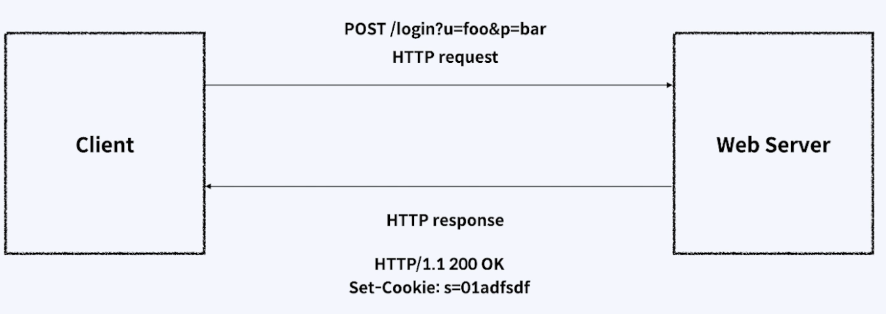
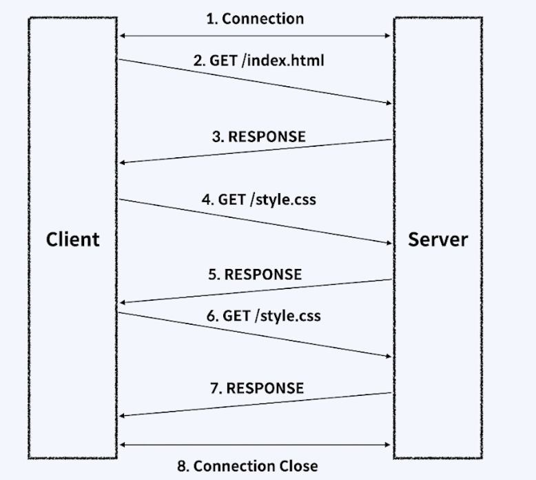
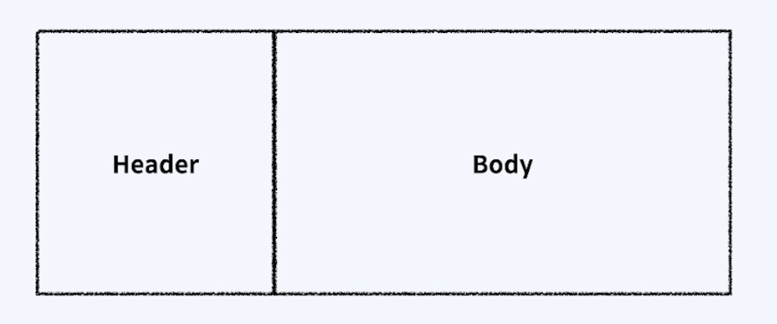

---
## 목차

- [URLSession을 이용하여 HTTP 통신 수행하기](#urlsession을-이용하여-http-통신-수행하기)
- [openweather 날씨 API 사용해보기](#openweather-날씨-api-사용해보기)
- [기본 UI구성하기](#기본-ui구성하기)
- [기능 구현하기](#기능-구현하기)

 

---

## URLSession을 이용하여 HTTP 통신 수행하기

 

### 01. HTTP 프로토콜은 기본적으로 어떻게 구성되어 있나요?

&nbsp;&nbsp;&nbsp;&nbsp; 

- HTTP 통신은 기본적으로 요청request와 응답response로 이루어져 있습니다
- 예를 들어 브라우저에 구글을 입력하면 클라이언트의 웹 브라우저를 통해 구글서버에 구글 시작 페이지를 보여달라고 요청합니다
- 구글 서버는 클라로부터 요청을 받으면 구글 시작 페이지에 해당는 html페이지를 클라이언트에게 돌려줍니다.
- 따라서 기본적으로 클라이언트와 서버는 연결되어 있지 않습니다.

#

### 02. 클라이언트와 서버가 연결되어 있지 않는다는게 어떤 뜻인가요?

&nbsp;&nbsp;&nbsp;&nbsp; 

- 서버가 클라에게 연결을 보내면 곧바로 연결을 종료한다는 것을 의미합니다

#

### 03. HTTP 패킷이란 무엇인가요?

&nbsp;&nbsp;&nbsp;&nbsp; 

- HTTP 통신은 요청을 보내고 응답을 받을 때 패킷을 통해 주고 받습니다.
- 패킷은 크게 header와 body로 구성되어 있습니다.
- 패킷에는 보내는 사람의 주소, 받는 사람의 주소, 패킷의 생명시간등이 들어가 있고 body에는 통신하려는 데이터가 들어있습니다

#

### 04. HTTP 메서드 종류에 대해서 설명해주세요

- **GET**: 클라이언트가 서버에 리소스를 요청할 때 사용합니다.
- **POST**: 클라이언트가 서버의 리소스를 새로 만들때 사용합니다.
- **PUT**: 클라이언트가 서버의 리소스를 전체 수정할 때 사용합니다.
- **PATCH**: 클라이언트가 서버의 리소스를 일부 수정할 때 사용합니다.
- **DELETE**: 클라이언트가 서버의 리소스를 삭제할 때 사용합니다.
- HEAD: 클라이언트가 서버의 정상 작동 여부를 확인할 때 사용합니다.
- OPTIONS: 클라이언트가 서버에서 해당 URL이 어떤 메소드를 지원하는지 확인할 때 사용합니다.
- CONNECT: 클라이언트가 프록시를 통하여 서버와 SSL 통신을 하고자 할 때 사용합니다.
- TRACE: 클라이언트와 서버간 통신 관리 및 디버깅을 할 때 사용합니다.

#

### 05. 서버가 보내주는 상태코드 종류에 대해서 설명해주세요

- 100번대 Informational: 요청정보를 처리중 
- **200번대** Success: 요청을 정상적으로 처리함
- 300번대 Client Error: 요청을 완료하기 위해 추가 동작 필요
- **400번대** Client Error: 서버가 요청을 이해하지 못함
- **500번대** Server Error: 서버가 요청 처리 실패함

#

### 06. URLSession이란 무엇인가요?
- URLSession이란 앱과 서버가 통신하기위한 API입니다.
- 앱은 하나이상의 URLSession 인스턴스를 만들고 각 인스턴스는 관련 데이터 통신에 관여합니다
- 각 Session에서 앱은 특정 URL에 대한 요청을 나타내는 일련의 작업을 추가합니다.
- URLSession도 request(요청)와 response(응답)를 통해 통신합니다

#

### 07. URLSession은 어떻게 구성되어 있나요?

- URLSession은 `URLSessionConfiguration`과 `URLSessionTask`를 통해 구성되어 있습니다
- URLSessionConfiguaration의 종류는 다음과 같습니다
1. `URLSession.shared()`(Shared Session): 싱글톤으로 사용되는 세션으로 기본요청을 할 수 있습니다.
2. `URLSession(configuration:.defaul)`(Default Session): 기본세션은 이전의 공유세션보다 좀더 커스터마이징해서 사용할 수 있습니다. 순차적으로 데이터를 처리하기 위해 델리게이트를 지정할 수 있습니다
3. `URLSession(configuration:.ephemeral)`(Ephemeral Session): 임시세션은 공유세션과 비슷하지만 캐시, 쿠키, 사용자인증정보를 디스크에 저장하지 않습니다. 메모리에 올려서 세션을 사용하기 때문에 세션완료시 데이터가 사라집니다.
4. `URLSession(configuration:.background)`(Background Session): 백그라운드 세션은 앱이 실행되지 않는 동안 컨텐츠 업로드, 다운로드를 할 수 있습니다.
- `URLSessionTask`의 종류로는 다음과 같습니다
1. `URLSessionDataTask`: 데이터 객체를 사용하여 데이터 요청 및 응답을 수행합니다. 주로 짧고 빈번하게 사용되는 경우에 이용됩니다.
2. `URLSessionUploadTask`: 파일형태의 업로드를 통신하는데 사용됩니다. 앱이 실행되지 않았을 때 백그라운드 업로드를 지원합니다
3. `URLSessionDownloadTask`: 데이터를 다운받아서 파일형태로 저장하는 작업을 수행합니다. 백그라운드 다운로드를 지원합니다.
4. `URLSessionStreamTask`: TCP/IP 영역을 사용할 때 만듭니다.
5. `URLSessionWebSocketTask`: 웹소켓 프로토콜로 통신합니다.

#

### 08. URLSession은 어떻게 구현되나요?

1. Session Configuration을 결정하고, Session을 생성합니다.
2. 통신할 URL과 Request 객체를 설정합니다
3. 사용할 Task를 결정하고 그에 맞는 Completion Handler 나 Delegate 메소드들을 작성합니다
4. 해당 Task를 실행합니다
5. Task 완료 후 Completion Handler 클로저가 호출됩니다.

 

---

## openweather 날씨 API 사용해보기

 

### 01. 

